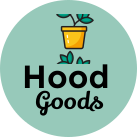

<p align="center">
  
</p>

<p align="center">
  <a href="https://github.com/muzzammilwits/hoodgoods/actions/workflows/ci.yml">
    
  </a>
  &nbsp;&nbsp;&nbsp;
  <a href="https://sonarcloud.io/summary/new_code?id=MuzzammilWits_HoodGoods">
    
  </a>
  &nbsp;&nbsp;&nbsp;
  <a href="https://github.com/muzzammilwits/hoodgoods/releases/latest">
    
  </a>
</p>


---


#  HoodsGoods - Handmade Marketplace

**HoodsGoods** is a vibrant online marketplace connecting talented local artisans with conscious consumers who value handcrafted quality. Our platform supports independent South African creators, providing them with a digital space to showcase their unique skills and products. HoodGoods, where art meets appreciation.

---

##  Getting Started

Follow these steps to get the project running locally:)

---

## Prerequisites

Make sure you have the following installed:

* [Git](https://git-scm.com/) – For cloning the repository
* [Node.js](https://nodejs.org/) – JavaScript runtime (run `node -v` to verify)
* [Bruno (Optional but Recommended)](https://www.usebruno.com/downloads) – for API testing

---

##  Setup Instructions

### Step 1: Clone the Repository

You should first open a git bash terminal, then cd into where you would like the repo to live, once you found the right place for it run the following commands:

```bash
git clone https://github.com/MuzzammilWits/HoodGoods.git
cd HoodGoods
ls
```

You should see: `backend`, `frontend`, and `brunoAPI`

---

### Step 2: Backend Setup

```bash
cd backend
npm i -g @nestjs/cli
npm install
nest start
```

Open [http://localhost:3000](http://localhost:3000) in your browser.
You should see: `Hello world!`


Press `CTRL+C` in the terminal to stop the backend server.

```bash
cd ..
```

---

### Step 3: Frontend Setup

```bash
cd frontend
npm install
npm run dev
```

You’ll see a local URL, usually [http://localhost:5173](http://localhost:5173).
Open it in your browser – you should see the landing page of HoodGoods.


Press `CTRL+C` in the terminal to stop the frontend server.

```bash
cd ..
```

---

###  Daily Development Workflow

In future sessions, just run these commands in two separate terminals:
This allows the backend and frontend to be running at the same time so you can locally test and develop the website.

**Backend:**

```bash
cd backend
nest start
```

**Frontend:**

```bash
cd frontend
npm run dev
```

---

###  Bruno API Testing (Optional)

1. Install Bruno: [https://www.usebruno.com/downloads](https://www.usebruno.com/downloads)
2. Start your backend:

   ```bash
   cd backend
   nest start
   ```

   (Leave this running)
3. Open Bruno, click **Open Collection** (and go to your HoodGoods folder/repo and then click on the brunoAPI folder and select the BrunoAPI inside of that and open it, the path will be something like this below.):

   ```
   brunoAPI/BrunoAPI/HoodGoods API.bru
   ```
4. Click `GET test1` in the sidebar.
5. Ensure the top bar shows: `GET http://localhost:3000/`
6. Click the right arrow (>) to send the request.
7. You should receive a `200 OK` with `Hello World!` in the response.


Bruno is a fast, local API testing tool, similar to Postman.

---

## Project Structure once you all good to go :)

```
HoodGoods/
├── backend/            # NestJS backend application
│   ├── src/
│   ├── test/
│   └── package.json
├── frontend/           # Vite + React frontend application
│   ├── public/
│   ├── src/
│   │   ├── assets/
│   │   ├── components/
│   │   ├── context/
│   │   ├── pages/
│   │   ├── services/
│   │   ├── types/
│   │   └── App.tsx, main.tsx
│   └── package.json
├── brunoAPI/           # Bruno API testing collections
└── README.md
```

---

## Key Technologies Used

### **Frontend:**

* React + TypeScript
* Vite
* Auth0 (authentication)
* Axios (API requests)
* React Router
* Chart.js
* Yoco SDK (payments)
* Vanta.js (animated backgrounds)

### **Backend:**

* NestJS (Node.js + TypeScript)
* Supabase (PostgreSQL)
* JWT (auth)

### **Testing & Dev Tools:**

* Vitest (frontend tests)
* Jest (backend tests)
* Bruno (API testing)
* SonarQube (code quality)
* Git & GitHub (version control)

---

